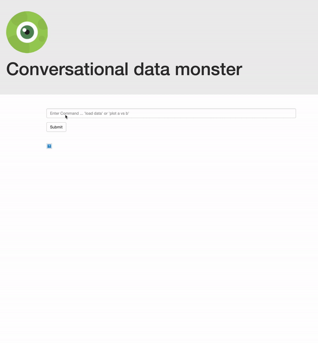

# conversational-data-monster

converse with your data



<!--## Installation

Requirements:
```
npm install
```-->


## Running

```
$ export FLASK_APP=app
$ flask run
```
or
```
python3 app.py
```

## Instructions

Example list of current commands:

- "load data"
- "plot country vs population"
- clear


Also see docs folder for info.